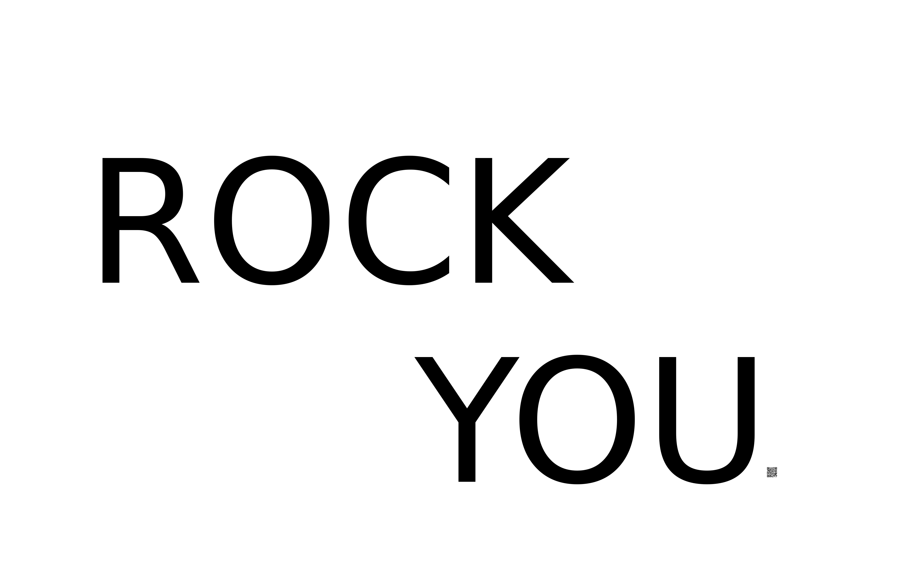

### Cevap 2 ###

Sorunun dosyası soru2.jpg dosyası :

Jpg dosyasının sağ alt köşesinde bir **QR kod** bulunmaktadır.

 Bu **QR kod** okutulduğunda **900ec79a8304cb4494562fb4fc1b9562** elde edilmiştir. Elde edilen bu **MD5** hash **rockyou.txt** wordlist ile brute force edilmiştir.

Böylece flag, **freeyourmind** olarak bulunmuştur.
